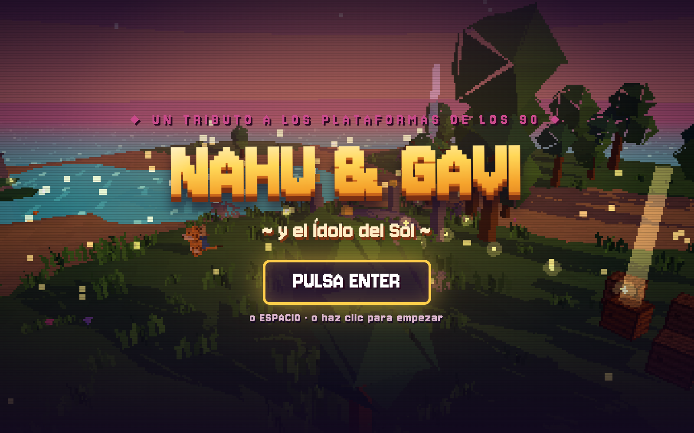
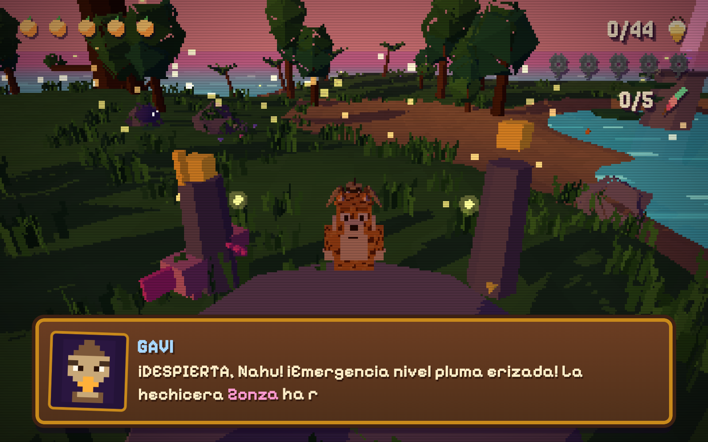
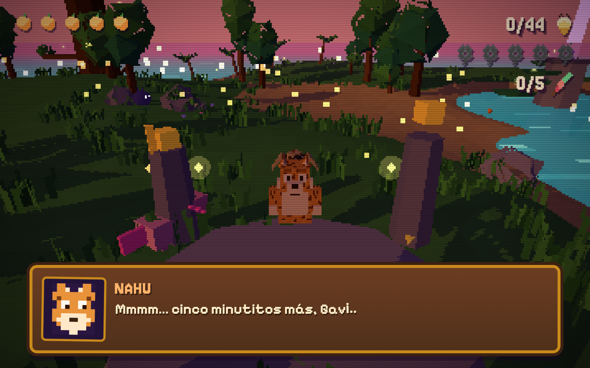

<div align="center">



# 🐆 NAHU & GAVI · El Ídolo del Sol

**Un plataformas 3D de navegador, tributo a los clásicos coleccioneros de los 90.**

[](https://gavilanbe.github.io/nahugavi/)


</div>

---

## 🌴 Qué es esto

**NAHU & GAVI** es un plataformas 3D que corre en cualquier navegador, homenaje a
los *collectathon* tipo Banjo-Kazooie. Exploras la **Selva Susurrante** con Nahu
(el jaguar) y Gavi (su compañera aladita): corres, saltas, aleteas, nadas y buceas
recogiendo luciérnagas, orquídeas y plumas mientras esquivas a las Sombras.

Todo es **100% procedural y cero assets**: geometría, texturas, audio y música se
generan por código. No hay ni una imagen ni un archivo de sonido en disco — solo
JavaScript, un `<canvas>` WebGL y mucho `Math`.

## 📖 La historia

> La hechicera **Zonza** ha robado los **nueve Ídolos del Sol** y los ha
> desperdigado por el mundo. Sin ellos, la luz se apaga.
>
> Nahu despierta en la **Selva Susurrante** con Gavi revoloteando a su lado:
> *"¡Emergencia nivel pluma erizada!"*. Hay que recuperar el **primer Ídolo** —
> y para eso, antes, ayudar al chamán **Axol** y reunir las orquídeas de la jungla.

## 🎮 Cómo se juega

| Tecla | Acción |
|---|---|
| `W A S D` / `← ↑ ↓ →` | Mover a Nahu |
| `Espacio` | Saltar · en el aire Gavi aletea (×4) · en agua, subir |
| `J` / clic izq. | Zarpazo · en el aire, picotazo de Gavi |
| `K` | Picotazo-bomba · en el agua, bucear |
| `E` | Hablar / interactuar |
| `Ratón` | Arrastrar para girar la cámara · rueda para zoom |
| `Enter` | Empezar / confirmar |

En móvil aparecen mandos táctiles automáticamente.

## 📸 Capturas

| En plena selva | Acción y diálogos |
|:--:|:--:|
|  |  |

## ▶️ Jugar

La forma más fácil: **[gavilanbe.github.io/nahugavi](https://gavilanbe.github.io/nahugavi/)**.

### En local

No hay que instalar ni compilar nada (Three.js se carga por CDN). Solo sírvelo como estático:

```bash
git clone https://github.com/gavilanbe/nahugavi.git
cd nahugavi
python3 -m http.server 4321   # o: make run
# abre http://localhost:4321
```

## 🛠️ Bajo el capó

- **Vanilla JS (ES modules)**, sin framework ni bundler — **Three.js 0.165** vía import map de jsdelivr.
- **Render:** resolución interna fija (224 px) escalada con `image-rendering: pixelated` + scanlines/viñeta CRT.
- **Todo procedural:** geometría low-poly, texturas pixel-art en `<canvas>`, niebla, cielo con gradiente y tinte subacuático generados en código.
- **Audio en vivo:** Web Audio API con buses + efectos y un secuenciador de marimba pentatónica a 84 BPM (sin archivos).
- **Motor/contenido separados:** añadir un nivel = copiar una carpeta y cambiar `heightmap`, `landmarks` y `quest`. Ver **[`ARCHITECTURE.md`](ARCHITECTURE.md)**.

## 📦 Créditos

Parte de mi colección de juegos. Dirigido y publicado por [**@gavilanbe**](https://github.com/gavilanbe).

## 📄 Licencia

[MIT](LICENSE) — úsalo y trastéalo a gusto.

<div align="center"><sub>HECHO CON RECTÁNGULOS EN 3D · 2026</sub></div>
